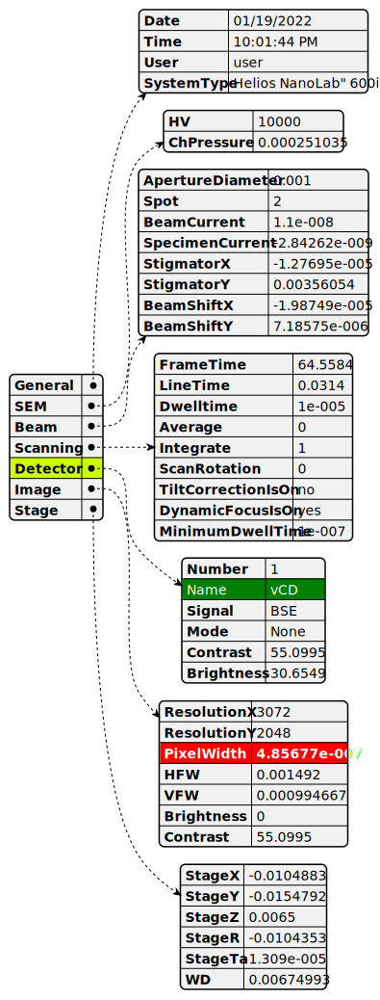

# **mochada_kit**

Python code for generating MODA (MOdelling DAta) and CHADA (CHAracterisation DAta) workflow diagrams and tables using [plantuml](https://plantuml.com/), with machine-readable, enhanced design based on bespoke themes.

### **Main uses**
**1. Generate MODA and/or CHADA workflow diagrams with bespoke themes, making them machine readable.**

The diagram below is a legend for a CHADA workflow, showing the types of the elements. The plantuml code used to produce this diagram is below on the right. After a command signalling the start of the code, we load one of the bespoke themes. This allows us to apply a "stereotype" to each element, giving it a colour according to its type. Each theme has different colours for the various elements (see section 4. below for the available colour schemes).

- The text to be displayed in an element is defined between a colon and a semicolon *e.g.* :User Case;
- The type of the element is specified by applying a stereotype between two sets of angled brackets *e.g.* \<\<user_case\>\>
- This allows the code to be machine readable: the text of each element can be easily associated with the type of element and connected to the antecedent and descendant elements.

<br>

<table>
<tr>
<td> flow diagram legend </td> <td> plantuml code </td>
</tr>
<tr>
<td>  </td>
<td>


```
@startuml
!theme MOCHADA-plasma from ../../themes
:User Case; <<user_case>>
:Experiment; <<experiment>>
:Raw Data; <<raw_data>>
:Data Processing; <<data_processing>>
:Final Data; <<final_data>>
@enduml
```


</td>
</tr>
</table>

<br>

<br>

Below is an example of a CHADA workflow diagram for EBSD in the SEM and the code used to produce the diagram is shown on the right. Note that the definition of the element can be split over multiple lines.

<br>

<table>
<tr>
<td> chada workflow EBSD </td> <td> plantuml code </td>
</tr>
<tr>
<td>  </td>
<td>


```
@startuml
!theme MOCHADA-plasma from ../../themes
:Bulk sample or thin film; <<user_case>>
:Set up experimental geometry:
sample tilt (<U+00B0>), working distance (mm),
detector distance (mm); <<experiment>>
:Acquire electron image (SE, BSE, FSE); <<experiment>>
:Electron image(s); <<raw_data>>
:Define rectangular ROI, step size,
detector and indexing parameters; <<experiment>>
:Acquire EBSD patterns at all points in ROI; <<experiment>>
:EBSD pattern for each point; <<raw_data>>
:Hough indexing (automatic); <<data_processing>>
:Euler angles and phase ID
for each point in map; <<final_data>>
:Analysis of orientations (user controlled); <<data_processing>>
:Orientation maps, Pole figures
Quantitative measures //e.g.// grain size; <<final_data>>
@enduml
```


</td>
</tr>
</table>

<br>

<br>

We can group techniques in order to provide a clear overview of more complex cases *e.g.* for SEM-EDX-EBSD:

<br>


<br>

**2. Generate CHADA tables from a single json file, with bespoke themes, and optionally hyperlinking different tables**


<br>

**3. Extract and display metadata from an HDF5 file as an easy-to-read diagram with optional bespoke highlighting**



<br>

**4. Define your own colour schemes and stereotypes**


<br>

### **Installation**
Please clone this repository and install it as an editable package using pip (that way you can easily pull updates from the repo and they will be active without needing to reinstall anything):

```
cd mochada_kit
pip install -e .
```

<br>

### **Dependencies**
- **h5py**: if you do not already have it, [h5py](https://docs.h5py.org/en/stable/index.html) will be installed by pip during installation of `mochada_kit`

- to generate the diagrams, you need to have `plantuml.jar` saved on your system. Please see [here](https://plantuml.com/download) for download and licensing options

- in order to run [plantuml](https://plantuml.com/), you also need [java](https://www.java.com/en/download/help/index_installing.html). To check if you already have `java` installed, you can type `java -version` at the terminal.

<br>

### **Setup**
In order that `mochada_kit` can use plantuml, we need to provide the path to `plantuml.jar` to the Python functions. You can do this each time simply by passing in the path, or you can also generate a configuration file which will save this information in your home folder, so that you don't have to enter it in the Python functions every time. To set up the configuration, run:
```
mochada_kit -c -p path/to/my/plantuml.jar
```
and this will write `.mochada_kit/config.json` to the current user's home folder. You can now use the Python functions in `mochada_kit` and the program will already know where `plantuml.jar` is located and will be able to run it.

<br>

### **Getting started**
- to get an idea of what the workflow diagrams, tables and json diagrams look like, please have a look at the .svg images in `mochada_kit/gallery`. You can open .svg files in any browser. The plantuml (puml) code on which they are based is available in `mochada_kit/gallery/puml_code`.

- detailed examples are provided as jupyter notebooks in `mochada_kit/examples` and as Python scripts in `mochada_kit/examples/python_scripts`. Here is a short description of each example:

|Example &nbsp; &nbsp; &nbsp;|Description &nbsp; &nbsp; &nbsp;|
|:---|:---|
|`make_workflow_diagram.ipynb` | basic introduction to making workflow diagrams |
|`using_hyperlinks_in_workflow_digarams.ipynb` | how to use hyperlinks to link several diagrams or to link to an external resource |
|`make_CHADA_tables_from_json.ipynb` | how to use plantuml to generate CHADA tables from a single json file |
|`json_diagram_from_hdf5_metadata.ipynb` | extract metadata from an hdf5 file and plot it as a json diagram with plantuml with optional bespoke highlighting|
|`generating_mochada_themes.ipynb` | how to make MOCHADA themes with different colour schemes |
|`CHADA_and_MODA_legend_all_themes.ipynb` | put a legend for MODA and CHADA elements for all the different themes in one plot for comparison |
|`CHADA_legend_all_themes.ipynb` | put a legend for CHADA elements for all the different themes in one plot for comparison |
|`MODA_legend_all_themes.ipynb` | put a legend for MODA elements for all the different themes in one plot for comparison |

<br>

### **Reference**
This package is being developed as part of the EU project: [MaMMoS](https://mammos-project.github.io/index.html)


